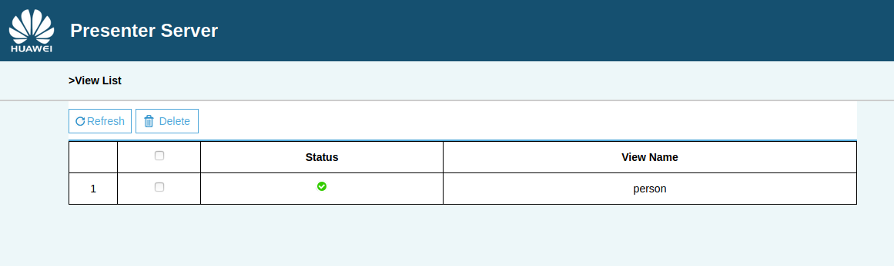

# 人像分割与背景替换（C++）

本Application支持运行在Atlas 200 DK上，实现了摄像头读入图片，Portrait网络输出人像mask结果并根据结果做背景替换。

## 软件准备

运行此Sample前，需要获取源码包。

1.  获取源码包。

    **下载该项目**

    **复制code部分到$HOME/AscendProjects中**
    
2.  获取此应用中所需要的原始网络模型。
 
     -  下载原始网络模型至ubuntu服务器任意目录，如:$HOME/models。

        **mkdir -p $HOME/models**

        **下载人像分割pb模型到上述目录中，下载地址：https://cloud.tsinghua.edu.cn/f/e96be6f82e994ecc8fb6/?dl=1**

3.  将原始网络模型转换为适配昇腾AI处理器的模型。

    1.  在Mind Studio操作界面的顶部菜单栏中选择**Tools \> Model Convert**，进入模型转换界面。
    2.  在弹出的**Model Conversion**操作界面中，进行模型转换配置。
    3.  参照以下图片进行参数配置。
        -   Model File选择[步骤2]下载的模型文件。
        -   模型输入选择fp16。
        -   Model Image Format选择BGR。
        -   Variance填0.017。

    
    
    

    
4.  将转换好的模型文件（.om文件）上传到[步骤1]中源码所在路径下的“**PortraitC73/model**”目录下。
    
     **cp \\$HOME/modelzoo/portrait/device/portrait.om \\$HOME/AscendProjects/PortraitC73/model/**
  

## 环境配置

**注：服务器上已安装交叉编译工具可跳过此步骤。**
      
- 安装编译工具
  **sudo apt-get install -y g++\-aarch64-linux-gnu g++\-5-aarch64-linux-gnu**

- 安装PresenterAgent
  请参考 https://gitee.com/ascend/samples/tree/master/common/install_presenteragent/for_atlas200dk
      
- 安装host端的opencv、numpy、ffmpy、ffmpeg
  **sudo apt-get install -y ffmpeg**
  **python3.7.5 -m pip install numpy opencv-python ffmpy --user**
  

## 编译

1.  打开对应的工程。

    以Mind Studio安装用户在命令行进入安装包解压后的“MindStudio-ubuntu/bin”目录，如：$HOME/MindStudio-ubuntu/bin。执行如下命令启动Mind Studio。

    **./MindStudio.sh**

    启动成功后，打开**PortraitC73**工程，如[图 打开PortraitC73工程]所示。

    **图 1**  打开PortraitC73工程  
    

2.  修改配置文件

    将data/param.conf中的 **presenter_server_ip、presenter_view_ip** 修改为Mind Studio所在Ubuntu服务器的虚拟网卡的ip地址， **presenter\_agent\_ip** 修改为开发板上和ubuntu服务器连接的网口ip。如下图所示。

    

3.  开始编译，打开Mind Studio工具，在工具栏中点击**Build \> Edit Build Configuration**。  
    选择Target OS 为Centos7.6，如[图 配置编译]所示。

    **图 2**  配置编译
      
    
    之后点击**Build \> Build \> Build Configuration**，如[图 编译操作及生成文件]所示，会在目录下生成build和out文件夹。

    **图 3**  编译操作及生成文件
    

4.  启动Presenter Server。

    打开Mind Studio工具的Terminal，在应用代码存放路径下，执行如下命令在后台启动facedetection应用的Presenter Server主程序。如[图 启动PresenterServer]所示。

    **bash script/run_presenter_server.sh**

    **图 4**  启动PresenterServer  
    
   
  
    如[图 启动PresenterServer]所示，表示presenter_server的服务启动成功。  
    **图 5**  启动PresenterServer 
    
 
## 运行

1.  单击  **Run \> Run 'facedetection'**，如[图 程序已执行示意图]所示，可执行程序已经在开发者板执行。  

    **图 6**  程序已执行示意图
    

2.  使用启动Presenter Server服务时提示的URL登录 Presenter Server 网站。

    等待Presenter Agent传输数据给服务端，单击“Refresh“刷新，当有数据时相应的Channel 的Status变成绿色，如下图所示。

    **图 7**  Presenter Server界面 
     

3.  单击右侧对应的View Name链接，比如上图的“person”，查看结果。
 
## 结束应用

命令行执行以下命令登陆开发板（密码：Mind@123）。

**ssh HwHiAiUser@192.168.1.2**

执行以下指令查找仍在运行的进程。

**ps -ef | grep ./workspace_mind_studio_PortraitC73**

打印如下：

*HwHiAiU+  2417  2415  7 08:05 ?        00:00:05 ./workspace_mind_studio_PortraitC73*

杀死进程：

kill -9 2417

## 命令行运行

1. Mindstudi运行问题
    
   Mindstudio中运行样例可能会有失败或样例运行卡顿现象。
    
   这是Mindstudio版本导致的问题。当前解决办法为Mindstudio运行出问题后登录开发板，在命令行运行样例。

   **注：必须要在Mindstudio中先运行一次，否则二进制文件等数据不会传到开发板上**    

2. 在开发环境命令行中以普通用户执行以下命令登录开发者板（默认USB连接）。

    **ssh HwHiAiUser@192.168.1.2**

    

3. 进入案例对应可执行文件路径。
    
    **cd HIAI_PROJECTS/workspace_mind_studio/facedetection_xxx/out**

    其中xxx需要根据自己编译出来的文件夹名称自行替换。

    

 4. 启动程序。（需要在开发环境中已经启动presentserver并且已经按照编译和运行章节操作过一次）

    **bash run.sh**

 5. 按**ctrl\+c**即可结束程序。
